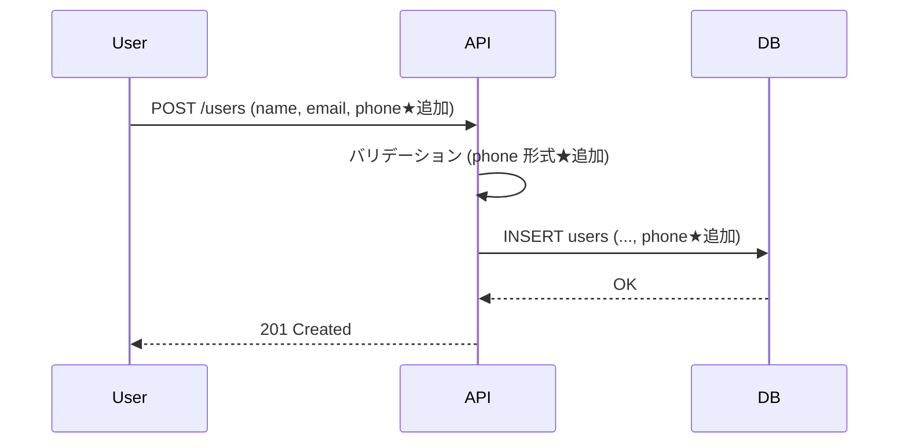

# 差分設計テンプレート（機能追加・改修）

既存システムへの機能追加・改修における**変更前／変更後の対比**を中心に記述する。
本テンプレートは「機能追加・改修（差分）」シナリオ、およびリプレイス時の差分章で使用する。

---

## 1. 差分設計サマリ

| 項目 | 内容 |
|------|------|
| 対象システム | {システム名} |
| 対象バージョン | 変更前 v{X.Y.Z} → 変更後 v{X.Y.Z} |
| 対応要件ID | FR-XXX, NFR-XXX |
| 影響範囲 | 画面 / API / DB / バッチ / 非機能（複数選択可） |
| リリース予定日 | YYYY-MM-DD |
| 後方互換性 | 維持 / 一部破壊（移行手順あり） / 完全置換 |

---

## 2. 変更点一覧

| # | 変更種別 | 対象 | 変更前 | 変更後 | 関連ID | 備考 |
|---|---------|------|-------|-------|-------|------|
| 1 | 追加 | 画面 | - | 月次レポート画面 | SCR-RPT-005 | FR-012 |
| 2 | 変更 | API | `GET /users` がメール返却 | メール＋電話番号を返却 | API-003 | 後方互換あり |
| 3 | 削除 | API | `POST /legacy-export` | - | API-099 | v2.0 で deprecated |
| 4 | 変更 | テーブル | `users.phone` カラム無し | `users.phone VARCHAR(20)` 追加 | TBL-001 / m_users | NULL 許可 |
| 5 | 変更 | エラー | ERR-AUTH-001 メッセージ修正 | より具体化 | ERR-AUTH-001 | UX改善 |

**変更種別**: 追加 / 変更 / 削除 / リネーム / 廃止予定（deprecated）

---

## 3. 章別 差分詳細

### 3.1 画面設計の差分

#### 追加: SCR-RPT-005 月次レポート画面

| 項目 | 内容 |
|------|------|
| 対応機能 | FR-045 月次集計レポート |
| 認証 | 必要（管理者ロール） |
| 呼出API | API-050 |

詳細は `screens/SCR-RPT-005.md` 参照。

#### 変更: SCR-USR-001 ユーザー一覧画面

| 観点 | 変更前 | 変更後 |
|------|-------|-------|
| 表示項目 | 名前, メール | 名前, メール, 電話番号 |
| ソート対象 | 名前のみ | 名前 / メール / 電話番号 |
| ページング | 20件/ページ | 50件/ページ |

---

### 3.2 API設計の差分

#### 変更: API-003 ユーザー一覧取得

| 観点 | 変更前 | 変更後 | 後方互換 |
|------|-------|-------|---------|
| レスポンス | `{name, email}` | `{name, email, phone}` | ○ フィールド追加のみ |
| クエリ | `?limit=20` | `?limit=20&sort=phone` | ○ 既存パラメータ維持 |
| エラー | 401 のみ | 401, 422 追加 | △ 新規エラーケース |

OpenAPI 差分: `openapi.yaml` の `paths./users.get` を参照。

#### 削除: API-099 レガシーエクスポート

- 廃止予定通知: v1.8 で deprecated 表記、v2.0 で完全削除
- 代替: API-100 新エクスポートAPIへ移行
- 既存利用者向け移行ガイド: `migration-guide.md`

---

### 3.3 DB設計の差分

#### 変更: TBL-001 / m_users

**カラム追加**

| 物理名 | 論理名 | 型 | NULL | デフォルト | 備考 |
|--------|-------|-----|------|----------|------|
| phone | 電話番号 | VARCHAR(20) | YES | NULL | 既存レコードは NULL |

**マイグレーション SQL**

```sql
ALTER TABLE m_users ADD COLUMN phone VARCHAR(20) NULL;
CREATE INDEX idx_m_users_phone ON m_users(phone);
```

**ロールバック SQL**

```sql
DROP INDEX idx_m_users_phone ON m_users;
ALTER TABLE m_users DROP COLUMN phone;
```

**データ移行要否**: 不要（NULL 許可のため）

---

### 3.4 処理フローの差分

#### 変更: ユーザー作成フロー

変更前と変更後の差分のみ Mermaid で示す。



★マークが今回の変更箇所。

---

### 3.5 非機能要件の差分

| 項目 | 変更前 | 変更後 | 根拠 |
|------|-------|-------|------|
| 同時接続数 | 1,000 | 3,000 | ユーザー基盤拡大予定 |
| 月次レポート生成時間 | 規定なし | 30秒以内 | 新機能のため新規定義 |

---

## 4. 影響分析

### 4.1 後方互換性

| 変更 | 互換性 | 影響を受ける利用者 | 対応 |
|------|-------|------------------|------|
| API-003 にフィールド追加 | あり | 既存クライアント | 影響なし |
| API-099 削除 | なし（破壊的） | 旧バッチA, B | 移行ガイド配布、3ヶ月並行稼働 |

### 4.2 既存機能への副作用

- TBL-001 へのカラム追加 → 既存クエリへの性能影響: なし（カラム追加のみ）
- 既存画面 SCR-USR-001 ページング変更 → ユーザー学習コスト発生（リリースノートで告知）

### 4.3 既存テストへの影響

- 修正必要: API-003 のレスポンス検証テスト
- 追加必要: phone カラム関連の単体テスト・E2Eテスト
- 削除: API-099 のテストスイート

---

## 5. リリース・ロールバック計画

### 5.1 リリース手順

1. DB マイグレーション実行（前方互換）
2. アプリケーションデプロイ
3. 動作確認（スモークテスト）
4. 旧APIの deprecated ログ監視開始

### 5.2 ロールバック条件・手順

| 条件 | 判断者 | 手順 |
|------|-------|------|
| 致命的エラー率 1% 超過 | 運用責任者 | アプリのみロールバック（DBは前方互換のため不要） |
| データ不整合検知 | DBA | アプリ＋DBロールバック（上記 SQL 使用） |

---

## 6. 確認事項（TODO）

| TODO | 確認先 | ブロッカー度 | 期限目安 |
|------|-------|-----------|---------|
| 旧API利用者への通知タイミング | PM | 設計FIX前必須 | レビュー前 |
| phone のフォーマット統一仕様 | 顧客 | 設計FIX前必須 | レビュー前 |
| 並行稼働期間の最終決定 | PM | 詳細設計フェーズ可 | 実装着手前 |
