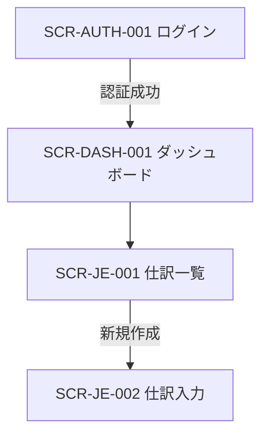
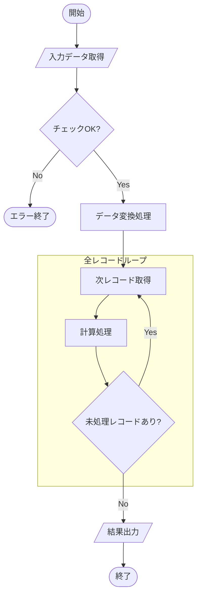
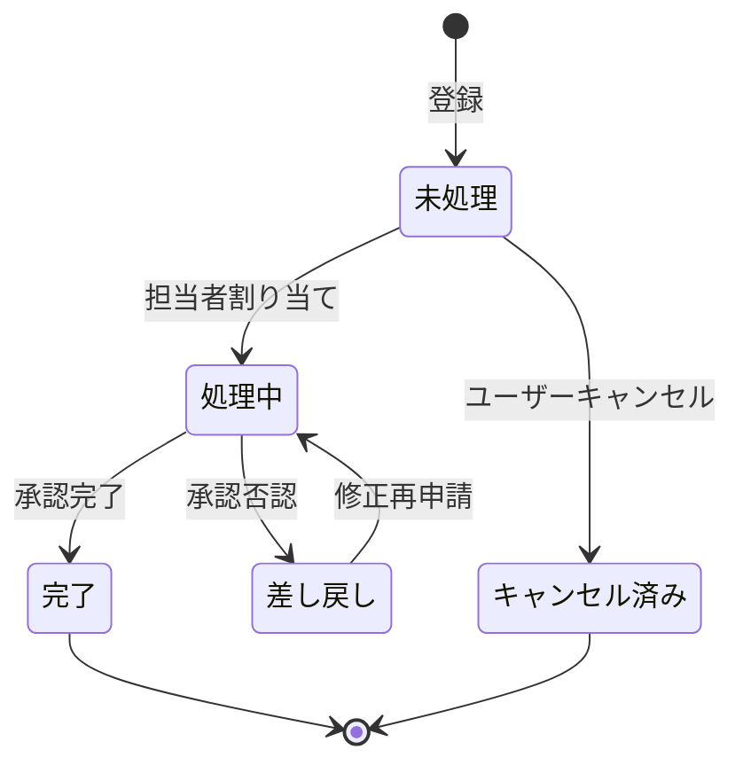

# 処理フロー設計テンプレート

## 1. 処理フロー概要
本章では、主要な機能における処理の流れ、コンポーネント間の相互作用、およびデータの状態遷移を定義する。
各要素（画面、API、テーブル）は、それぞれの設計書で定義された ID（例：SCR-001, API-001）を用いて記述し、トレーサビリティを確保すること。

---

## 2. 画面遷移図
Mermaid の `flowchart` を用いて、ユーザーの導線と条件分岐を定義する。



---

## 3. 処理シーケンス図
画面、API、ビジネスロジック、DB間のメッセージ対話を定義する。

> **必須ルール**: 各主要ユースケースのシーケンス図には、**ハッピーパス（正常系）に加えて、最低 1 つ以上の準正常系（バリデーションエラー／認可失敗／外部システムエラー／タイムアウト等）を必ず含める**こと。エラー処理を後回しにすると、実装フェーズで「エラー処理が雑なコード」が生成される。

### 3.1 {{機能名/ユースケース名}} — 正常系（ハッピーパス）

```mermaid
sequenceDiagram
    autonumber
    participant Actor as ユーザー
    participant UI as SCR-XXX (画面名)
    participant API as API-XXX (パス)
    participant DB as DB (テーブル名)

    Actor->>UI: アクション実行
    UI->>API: リクエスト送信 (POST /v1/...)
    
    API->>API: バリデーション (zod)
    
    API->>DB: トランザクション開始
    API->>DB: 登録/更新 (TABLE_NAME)
    API->>DB: コミット
    
    API-->>UI: 完了レスポンス (200/201)
    UI-->>Actor: 完了メッセージ表示
```

### 3.2 {{機能名/ユースケース名}} — 準正常系（必須）

代表的な失敗ケースを最低 1 つ図示する。複数の失敗パターンがある場合は alt/opt で表現するか、別シーケンスを追加する。

```mermaid
sequenceDiagram
    autonumber
    participant Actor as ユーザー
    participant UI as SCR-XXX
    participant API as API-XXX
    participant DB as DB
    participant Ext as 外部システム

    Actor->>UI: アクション実行
    UI->>API: リクエスト送信

    alt バリデーションエラー
        API->>API: zod 検証 → NG
        API-->>UI: 400 {error.code: ERR-XXX-001}
        UI-->>Actor: 入力エラー表示（該当項目をハイライト）
    else 認可エラー
        API->>API: 認可チェック → リソース所有者不一致
        API-->>UI: 403 {error.code: ERR-AUTH-002}
        UI-->>Actor: 権限エラー画面へ遷移
    else 外部システム障害
        API->>Ext: 連携呼出
        Ext--xAPI: タイムアウト (5秒)
        API->>API: 指数バックオフでリトライ x3
        API-->>UI: 503 {error.code: ERR-EXT-001}
        UI-->>Actor: 「しばらくしてから再試行してください」表示
    end
```

> エラーコード（`ERR-XXX`）は [error-design.md](./error-design.md) と一致させること。HTTPステータスコードと業務エラーコードの対応も同書で定義する。

---

## 4. アクティビティ図（ロジック詳細）
複雑なビジネスルールやバッチ処理の論理的な流れを定義する。

### {{処理名}}



> Mermaid のフローチャートでループを表現する場合は `subgraph` を用いて範囲を視覚化する。判定ノード（菱形）から戻り矢印を引くことで反復を示す。

**【主要なビジネスルール】**
- ルール1：...
- ルール2：...

---

## 5. 状態遷移図
データ（エンティティ）のライフサイクルと、状態遷移のトリガーを定義する。

### {{エンティティ名（例：受注、チケット）}}



**【状態定義】**
| 状態 | 定義 | 遷移条件 |
|------|------|----------|
| 未処理 | 初期登録直後の状態 | システム投入 |
| 処理中 | 作業が開始された状態 | 担当者IDがセットされること |
| ... | ... | ... |

---

## 6. 共通例外処理・エラー制御
システム全体で共通の例外ハンドリング、およびリカバリ方針を定義する。

- **リトライ方針**: ネットワークエラー時は最大3回リトライ
- **フォールバック**: 外部連携失敗時は代替データ（キャッシュ）を表示
- **通知**: 致命的エラー発生時は Slack/メールにてアラート通知
