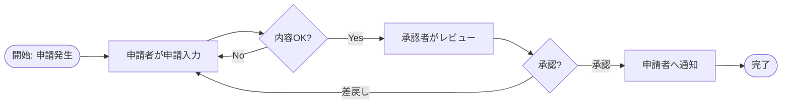

# {システム名} 要件定義書

## 改訂履歴

| 版 | 日付 | 変更内容 | 作成者 |
|---|---|---|---|
| 0.1 | YYYY-MM-DD | 初版 |  |

## 1. はじめに

### 1.1 文書の目的

### 1.2 背景・課題

### 1.3 適用範囲

### 1.4 用語・略語

| 用語 | 説明 |
|---|---|
|  |  |

### 1.5 参照資料

| 資料名 | 版/日付 | 備考 |
|---|---|---|
|  |  |  |

## 2. プロジェクト概要

### 2.1 目的・ゴール

### 2.2 成功基準

| ID | 成功基準 | 測定方法 |
|---|---|---|
| KPI-001 |  |  |

### 2.3 ステークホルダー

> **合意権限**を必ず明示する。要件確定の最終承認権限を持つのは誰か、レビューのみ行うのは誰か、対立時の優先順位を曖昧にすると要件FIXができない。

| 区分 | 名称/役割 | 関心事 | 責任 | 合意権限 | 対立時の優先 |
|---|---|---|---|---|---|
|  |  |  |  | 最終承認 / レビュー / 参照 | 1位/2位/... |

**合意権限の凡例**:
- **最終承認**: この人の OK が無いと要件FIXできない（通常 1〜2 名）
- **レビュー**: コメント・指摘の権限はあるが、最終決定権は持たない
- **参照**: 情報共有のみ。レビュー対象外

**対立時の優先**: 最終承認者が複数いて意見が割れた場合の優先順位を予め合意。例: 「業務オーナー > 情報システム部 > 利用者代表」

### 2.4 前提条件・制約条件

| ID | 種別 | 内容 | 影響 |
|---|---|---|---|
| CON-001 | 前提 |  |  |

## 3. 現状整理

### 3.1 現行業務概要

### 3.2 現行システム概要

### 3.3 課題一覧

| ID | 課題 | 影響 | 関連業務 |
|---|---|---|---|
| ISS-001 |  |  |  |

### 3.4 改善方針

## 4. To-Be業務要件

### 4.1 To-Be業務概要

### 4.2 業務フロー

> **記述方式**: Mermaid `flowchart` を推奨（基本設計の処理フローと表記を揃え、AIが基本設計に展開しやすくする）。複雑な業務はスイムレーンで担当者を明示する。

> 業務フローのアクター（申請者・承認者・外部システム等）は 2.3 ステークホルダーと一致させること。

### 4.3 ユースケース

### 4.4 業務ルール

| ID | 業務ルール | 対象 | 備考 |
|---|---|---|---|
| BRULE-001 |  |  |  |

## 5. システム化範囲

### 5.1 対象範囲

| ID | 対象 | 内容 |
|---|---|---|
| SCOPE-001 |  |  |

### 5.2 対象外

| ID | 対象外 | 理由 | 代替策 |
|---|---|---|---|
| OUT-001 |  |  |  |

### 5.3 責任分界

| 領域 | 顧客 | 開発/運用側 | 外部事業者 |
|---|---|---|---|
|  |  |  |  |

## 6. 機能要件

### 6.1 機能一覧

| ID | 機能名 | 概要 | 優先度 | 関連業務要件 |
|---|---|---|---|---|
| FR-001 |  |  | Must | BR-001 |

### 6.2 機能要件詳細

> 受入条件の本文は **13章「受入観点・受入基準」を SSoT** として `AC-XXX` で管理する。本表では `関連受入条件ID` 列で参照のみ行い、本文を直書きしない。

| ID | 機能名 | 要件 | 関連受入条件ID | 備考 |
|---|---|---|---|---|
| FR-001 |  |  | AC-001, AC-002 |  |

## 7. 画面・帳票要件

### 7.1 画面一覧

| ID | 画面名 | 利用者/ロール | 主要目的 | 関連機能 |
|---|---|---|---|---|
| SCRR-001 |  |  |  | FR-001 |

> Note: `SCRR-` は要件定義フェーズの画面要件ID。基本設計フェーズで具体化した画面IDは `SCR-` を使う（traceability.md 参照）。

### 7.2 画面要件

> 受入条件は `関連受入条件ID` で 13章の `AC-XXX` を参照する（本文を直書きしない）。

| ID | 画面名 | 要件 | 関連受入条件ID | 備考 |
|---|---|---|---|---|
| SCRR-001 |  |  | AC-003 |  |

### 7.3 帳票一覧

| ID | 帳票名 | 出力条件 | 関連機能 |
|---|---|---|---|
| RPT-001 |  |  | FR-001 |

### 7.4 帳票要件

| ID | 帳票名 | 要件 | 主要項目 | 備考 |
|---|---|---|---|---|
| RPT-001 |  |  |  |  |

### 7.5 通知要件

| ID | 通知名 | 通知契機 | 通知先 | 内容 | 関連機能 |
|---|---|---|---|---|---|
| NTF-001 |  |  |  |  | FR-001 |

## 8. データ要件

### 8.1 主要データ

| ID | データ名 | 概要 | 保持期間 | 備考 |
|---|---|---|---|---|
| DR-001 |  |  |  |  |

### 8.2 データ作成・更新・参照・削除要件

| ID | データ | CRUD | 要件 | 関連機能 |
|---|---|---|---|---|
| DR-001 |  | C/R/U/D |  | FR-001 |

### 8.3 データ保持・移行・削除要件

| ID | 対象データ | 要件 | 条件 | 備考 |
|---|---|---|---|---|
| DR-MIG-001 |  |  |  |  |

## 9. 外部連携要件

### 9.1 連携先一覧

| ID | 連携先 | 方向 | 方式 | 備考 |
|---|---|---|---|---|
| IR-001 |  | 送信/受信 |  |  |

### 9.2 入出力概要

| ID | 連携先 | 入出力データ | 主要項目 |
|---|---|---|---|
| IR-001 |  |  |  |

### 9.3 連携方式・頻度・責任分界

| ID | 連携先 | 方式 | 頻度 | 責任分界 |
|---|---|---|---|---|
| IR-001 |  |  |  |  |

### 9.4 開始/終了条件・接続確認条件

| ID | 連携先 | 開始条件 | 終了条件 | 接続確認方法 |
|---|---|---|---|---|
| IR-001 |  |  |  |  |

## 10. バッチ・データ処理要件

### 10.1 バッチ一覧

| ID | バッチ名 | 概要 | 頻度 | 関連要件 |
|---|---|---|---|---|
| BAT-001 |  |  |  | FR-001 |

### 10.2 入出力

| ID | バッチ名 | 入力データ/条件 | 出力データ/先 |
|---|---|---|---|
| BAT-001 |  |  |  |

### 10.3 処理頻度・処理期限

| ID | バッチ名 | スケジュール | 処理期限 | 最大処理時間 |
|---|---|---|---|---|
| BAT-001 |  |  |  |  |

### 10.4 異常時対応・リカバリ

| ID | バッチ名 | 異常時挙動 | リカバリ手順 | 通知先 |
|---|---|---|---|---|
| BAT-001 |  |  |  |  |

## 11. 非機能要件

> **目標値・根拠・優先度**までを本章で確定。**測定方法は基本設計への申し送り**として暫定記入し、検証スクリプト本体は基本設計 8章で作成。受入条件本文は 13.2 を参照（`関連受入条件ID` で連結）。

| ID | 分類 | 要件 | 目標値/条件 | 根拠 | 優先度 | 測定方法（基本設計への申し送り） | 関連受入条件ID |
|---|---|---|---|---|---|---|---|
| NFR-PERF-001 | 規模・性能 |  |  |  | Must |  | AC-XXX |
| NFR-AVAIL-001 | 可用性・信頼性 |  |  |  | Must |  | AC-XXX |
| NFR-EXT-001 | 拡張性 |  |  |  | Should |  | AC-XXX |
| NFR-SEC-001 | セキュリティ |  |  |  | Must |  | AC-XXX |
| NFR-OPS-001 | 運用・監視 |  |  |  | Must |  | AC-XXX |
| NFR-MAINT-001 | 保守性 |  |  |  | Should |  | AC-XXX |
| NFR-MIG-001 | 移行性 |  |  |  | Should |  | AC-XXX |
| NFR-ENV-001 | システム環境・中立性 |  |  |  | Could |  | AC-XXX |
| NFR-COMP-001 | 法令・コンプライアンス |  |  |  | Must |  | AC-XXX |

## 12. 移行・導入要件

### 12.1 移行対象

| ID | 対象 | データ量目安 | 備考 |
|---|---|---|---|
| MIG-001 |  |  |  |

### 12.2 移行方針

### 12.3 導入・教育・切替条件

| ID | 要件 | 条件 | 担当 |
|---|---|---|---|
| IMP-001 |  |  |  |

## 13. テスト・受入要件

> **受入条件 AC-XXX は本章を SSoT** とする。各機能要件・画面要件・非機能要件はここを参照する形で `関連受入条件ID` を持つ。

### 13.1 テスト要件

| ID | テスト種別 | 対象 | 条件 |
|---|---|---|---|
| TST-001 |  |  |  |

### 13.2 受入条件マスタ（AC-XXX）

各 AC は「対象要件」「観点」「判定基準」「測定方法」を 1 行で完結させる。本表が AC-XXX の唯一の定義。

| ID | 対象要件ID | 観点 | 判定基準（合格ライン） | 測定方法 | 合否判定 |
|---|---|---|---|---|---|
| AC-001 | FR-001 |  |  |  |  |
| AC-002 | FR-001 |  |  |  |  |
| AC-003 | SCRR-001 |  |  |  |  |
| AC-004 | NFR-PERF-001 |  |  |  |  |

### 13.3 検収条件

リリース判定（release-readiness）で確認する全体検収条件。個別の AC-XXX は 13.2 を参照。

## 14. 未決事項・リスク

### 14.1 未決事項一覧

| ID | 内容 | 担当 | 期限 | 影響範囲 | ブロッカー度 |
|---|---|---|---|---|---|
| TBD-001 |  |  |  |  | 要件FIX前必須 |

### 14.2 リスク・課題一覧

| ID | リスク | 影響 | 発生確率 | 対応方針 |
|---|---|---|---|---|
| RSK-001 |  |  |  |  |

## 15. トレーサビリティ

### 15.1 業務要件とシステム要件の対応

| 業務要件ID | 業務要件名 | 機能要件ID | 画面/帳票要件ID | 非機能要件ID | データ/連携要件ID |
|---|---|---|---|---|---|
| BR-001 |  | FR-001 | SCRR-001 |  |  |

### 15.2 要件と後続成果物の対応

| 要件ID | 基本設計で具体化する対象 | 候補ID/名称 | テスト観点 |
|---|---|---|---|
| FR-001 | 画面候補 | SCR-001 |  |
| FR-001 | API候補 | API-001 |  |
| DR-001 | DB/データ候補 | TBL-001 |  |

## 付録

### 付録A. 用語集

| 用語 | 説明 |
|---|---|
|  |  |

### 付録B. ヒアリング記録

| 日付 | 参加者 | 議題 | 決定事項 | 未決事項 |
|---|---|---|---|---|
|  |  |  |  |  |

### 付録C. 要件一覧

→ [requirements-list.md](./requirements-list.md) 参照
